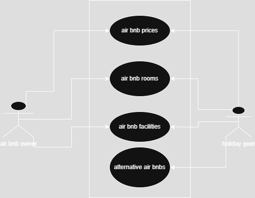

# Requirement Analysis in Software Development
  ## What is Requirement Analysis?
  - Requirement Analysis is a critical phase in the software development lifecycle (SDLC) where the project team gathers, analyzes, and defines the requirements of the software product to be developed. 
  - This process ensures that all stakeholders have a clear and mutual understanding of what the system should do and how it should perform.

  ## Why is Requirement Analysis Important?
  - Requirement analysis is the phase of a softwarae development lifecycle where the requirements of a project are defined, gathered and analyzed by the project team
  - Requirement analysis helps in the following ways:
     1. It helps the project team understand what the stakeholders require from the project.
     2. It helps a team define the scope of a project and its boundaries which helpes prevent scope creep.
     3. It helps build the basis for developing the foundations of a project.
     4. It helps the project team create accurate estimates of the time and resources that can be allocated to the project
     5. It helps ensure the final product aligns with customer expectations leading to greater customer satisfaction.
        
## Key Activities in Requirement Analysis
### Requirement Gathering
- This is the stage of requirements analysis where the project team engages with the stakeholders to determine what they want in the product
- This is done through various techniques such as surveys, workshops and interviews.
### Requirement Elicitation
- Refine and elaborate on the gathered requirements.
- Use techniques like brainstorming, focus groups, and prototyping
### Requirement Documentation
- Document the requirements in a detailed and structured format.
- Use requirement specification documents, user stories, and use cases.
### Requirement Analysis and Modeling
- Analyze and prioritize the requirements.
- Create models to visualize and understand the requirements.
### Requirement Validation
- Review and validate the requirements with stakeholders.
- Define acceptance criteria and ensure traceability

## Types of Requirements
### Functional Requirements
This are requirements that describe how a system should work. In the airbnb clone, examples would be a login page, property search, booking system user registration among others.

### Non Functional Requirements
These are requirements that describe how a system should perform. In the air bnb clone, examples include the page loading speed and even the reliability of transactions when booking.
## Use Case Diagrams
- These are diagrams that are used to show how different actors interact with a system to realize different outcomes.
- The benefits of using case diagrams include:
  - They provide a clear visual representation of how different components of the systems work.
  - They help in identifying and organizing system requirements
  - They help facilitate communication between stakeholders and the project team
- The following is an example of a use case diagram.
  
  
## Acceptance Criteria
- These are the conditions a project must meet so that it can accepted by stakeholders.
- Acceptance criteria are important because:
  - They provide the basis for testing and validation of features in the system
  - They ensure all parties have a clear understanding of existing requirements
  - They help in maintaining quality and user expectations.
- An example of user criteria that could be used for a checkout feature would be:
    - users should be able to confirm the air bnb they decide to choose and make a payment to book the air bnb in under two minutes
  
